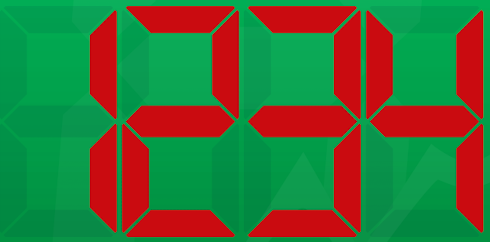
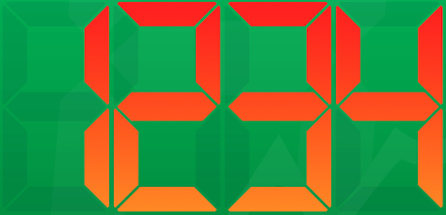
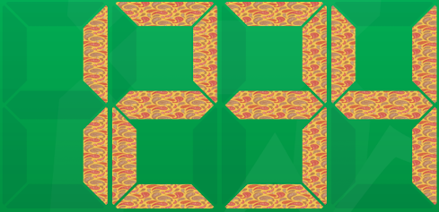
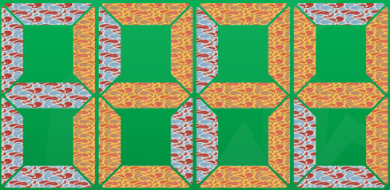
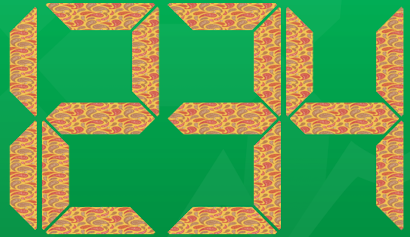

# ``RVS_RetroLEDDisplay``

Simple, Classic, Customizable Digital Display.

## Overview

This is a UIKit widget that displays a "classic" LED display (seven-segmented, simple digitital display). It does this by displaying a customizable background through a mask that simulates the "look and feel" of an old-fashioned LED display.

This is designed as an "aesthetic" widget, for use by apps that want to mimic "old time" displays, and want a bit more realism and customization than can be provided by "digital" fonts.

That said, a font gives you a great deal of flexibility, when it comes to content, and you may find [The RVS_MaskButton](https://github.com/RiftValleySoftware/RVS_MaskButton) module intersting, as well. [RVS_MaskButton](https://github.com/RiftValleySoftware/RVS_MaskButton) is not quite as customizable as this widget, but does allow you to use any font you want, in a very similar manner.

This widget is strictly for displaying old-fashioned LED digits.

## What Problem Does This Solve?

This widget was designed specifically for the rewrite of [The AmbiaMara Timer App](https://riftvalleysoftware.com/work/ios-apps/ambiamara/). That app presents [a classic "Vacuum Fluorescent"-style display](https://en.wikipedia.org/wiki/Vacuum_fluorescent_display).

## Find Out More

The following screengrabs are from [the Test Harness Project](https://github.com/RiftValleySoftware/RVS_RetroLEDDisplay/tree/master/Tests/RVS_RetroLEDDisplay_TestHarness), included with this package.

It's possible to use images and gradients to offer a lot of custom appearances:

|Figure 1: Standard Appearance|Figure 2: With Gradients|
|:--:|:--:|
|||

|Figure 3: Images In the "Active" Segments|Figure 4: And Also In the "Inactive" Segments|
|:--:|:--:|
|||

And you can also have blank "inactive" segments, and apply a "skew" of the display:

|Figure 5: Blank "Inactive" Segments|Figure 6: Skewed to the Right|Figure 7: Skewed to the Left|
|:--:|:--:|:--:|
||||

|Figure 8: A Long Skew|
|:--:|
||

## Usage

### Where to Get

In order to use this class, you should install it as a [Swift Package Manager (SPM)](https://swift.org/package-manager/) module.

You can use SPM to load the project as a dependency, by referencing its GitHub Repo URI (SSH: git@github.com:RiftValleySoftware/RVS_RetroLEDDisplay.git, or HTTPS: [https://github.com/RiftValleySoftware/RVS_RetroLEDDisplay.git](https://github.com/RiftValleySoftware/RVS_RetroLEDDisplay.git).

Once you have installed the module, you should include it in the file that will need to access it, like so:

    import RVS_RetroLEDDisplay

You can initialize via the Storyboard Editor, or directly, programmatically.

### Storyboard Editor Setup

### Programmatic Setup

You can simply initialize an instance of `RVS_RetroLEDDisplay`, as you would an instance of [`UIImageView`](https://developer.apple.com/documentation/uikit/uiimageview). If you initialize it with an image (setting the [`image`](https://developer.apple.com/documentation/uikit/uiimageview/1621069-image) property), then that image will be used as "fill" for the "inactive" segments.

You can also supply an image for the "active" segments of the display, by setting the [`onImage`](https://github.com/RiftValleySoftware/RVS_RetroLEDDisplay/blob/master/Sources/RVS_RetroLEDDisplay/RVS_RetroLEDDigitalDisplay.swift#L1221) property.

If you do not supply an image, then you can specify colors (including a gradient), to be used in the display.

The "active" and "inactive" backgrounds are independent of each other. You could, for example, have a gradient for the "inactive" segments, and an image for the "active" segments.

It can also have a "skew" applied, that gives it the classic "lean" of LED digital displays.

### Find Out More

[This is the technical documentation for the package](https://riftvalleysoftware.github.io/RVS_RetroLEDDisplay). It discusses the exposed public API, and the various properties that you can access.

[This is the Test Harness Project](https://github.com/RiftValleySoftware/RVS_RetroLEDDisplay/tree/master/Tests/RVS_RetroLEDDisplay_TestHarness). It has been designed as a simple project, and should provide excellent guidance in use of this package.

## Legal

[Attribution required for usage of Paisley Patterns, by ilonitta](https://www.freepik.com/free-vector/paisley-pattern-set_8565932.htm)

These patterns are only used in the [Test Harness](https://github.com/RiftValleySoftware/RVS_RetroLEDDisplay/tree/master/Tests/RVS_RetroLEDDisplay_TestHarness), so no attribution is required for use of the package.

### MIT License

Permission is hereby granted, free of charge, to any person obtaining a copy of this software and associated documentation
files (the "Software"), to deal in the Software without restriction, including without limitation the rights to use, copy,
modify, merge, publish, distribute, sublicense, and/or sell copies of the Software, and to permit persons to whom the
Software is furnished to do so, subject to the following conditions:

The above copyright notice and this permission notice shall be included in all copies or substantial portions of the Software.

THE SOFTWARE IS PROVIDED "AS IS", WITHOUT WARRANTY OF ANY KIND, EXPRESS OR IMPLIED, INCLUDING BUT NOT LIMITED TO THE WARRANTIES
OF MERCHANTABILITY, FITNESS FOR A PARTICULAR PURPOSE AND NONINFRINGEMENT.
IN NO EVENT SHALL THE AUTHORS OR COPYRIGHT HOLDERS BE LIABLE FOR ANY CLAIM, DAMAGES OR OTHER LIABILITY, WHETHER IN AN ACTION OF
CONTRACT, TORT OR OTHERWISE, ARISING FROM, OUT OF OR IN CONNECTION WITH THE SOFTWARE OR THE USE OR OTHER DEALINGS IN THE SOFTWARE.
